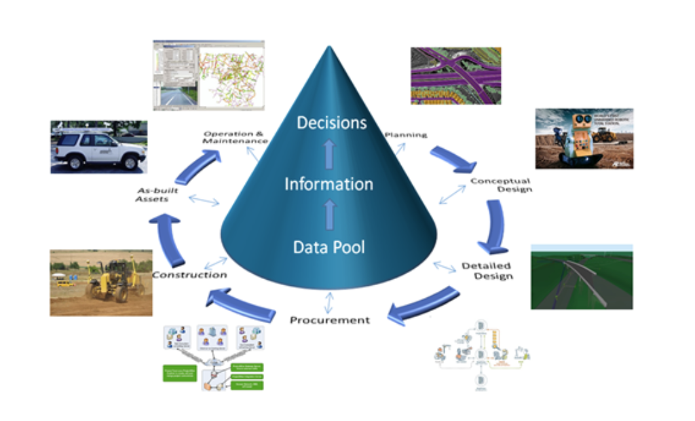
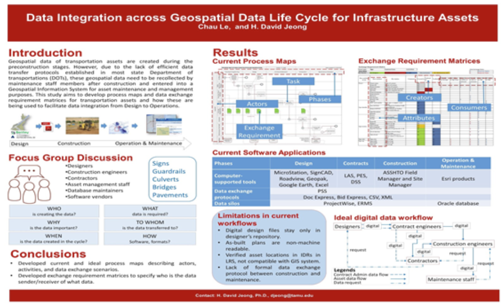
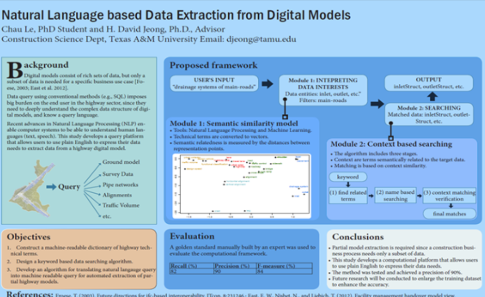
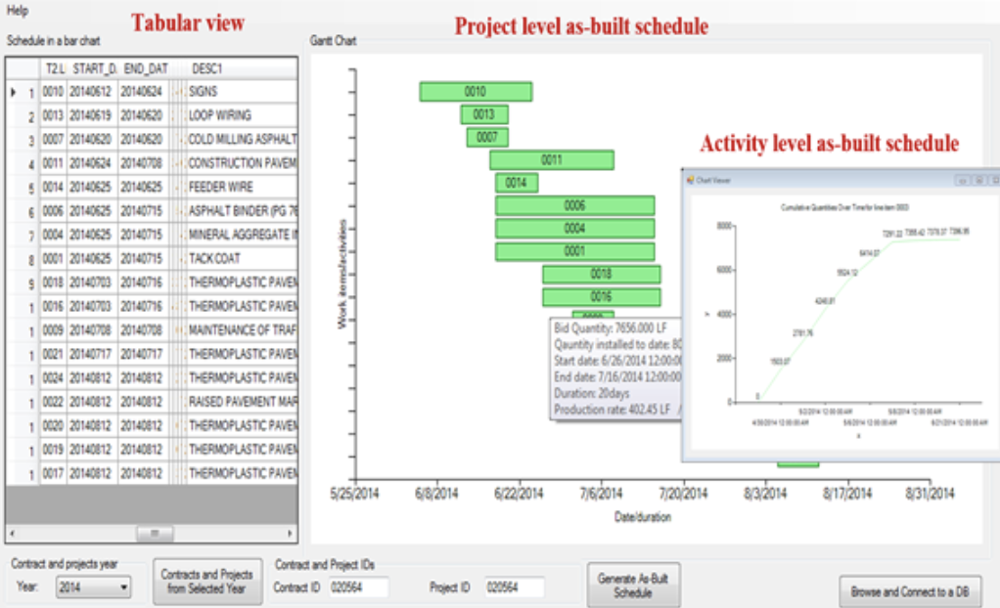

---
# Leave the homepage title empty to use the site title
title:
date: 2022-10-24
type: landing

sections:
  - block: markdown
    content:
      title:
      subtitle:
      text: |
        # DiReC Lab

        The Digital Innovation and Research in Construction (DiReC) Lab advances data-driven and AI-enabled models to improve work processes, efficiency, and sustainability across the built environment. Our research focuses on leveraging digital data and intelligent technologies to enhance decision-making throughout the project and asset life cycle. Despite the rapid digital transformation across other industries, construction continues to face challenges in fully harnessing the vast and growing data generated from projects, organizations, and industry systems. DiReC addresses this gap by combining artificial intelligence, machine learning, simulation, and data analytics to extract actionable insights from complex and heterogeneous data sources. Our team collaborates closely with industry partners to ensure our research is grounded in real-world challenges and produces practical, scalable impacts. Through interdisciplinary research and strong industry collaboration, DiReC aims to transform construction practices with intelligent, evidence-based, and socially responsible innovation.

        ## Current Research Areas

        **AI and data analytics for project intelligence** – automating the interpretation of project documents and requirements, and generating advanced solutions

        **Data interoperability for asset intensive industries** – developing open, neutral and standards based models for data and systems interoperability.

        **Workforce development and productivity solutions** – studying and developing effective solutions for critical construction workforce shortage.

        **Innovative games and simulations for construction education and training** – using interactive games and simulations to radically improve the effectiveness of educating project management knowledge and principles.
    design:
      columns: '1'

  - block: markdown
    content:
      title:
      subtitle:
      text: |
        

          

            

              
              

                <h3>AI and Data Analytics for Project Intelligence</h3>
                
Automating interpretation and generating advanced solutions

              

            

            

              
              

                <h3>Data Interoperability for Asset Intensive Industries</h3>
                
Open, standards-based models for systems compatibility

              

            

            

              
              

                <h3>Workforce Development and Productivity Solutions</h3>
                
Addressing construction labor shortages

              

            

            

              
              

                <h3>Games and Simulations for Education</h3>
                
Interactive training for project management

              

            

          

        

    design:
      columns: '1'
---
